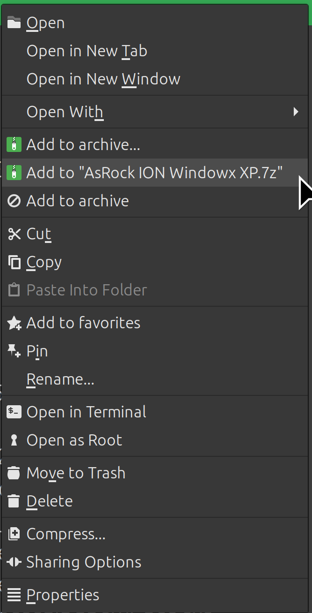
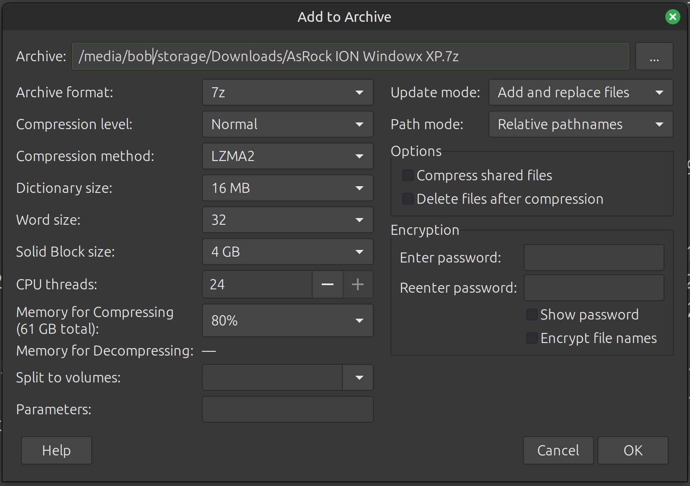

# Nemo 7-Zip Popup

Adds 7-Zip archive actions to the Nemo file manager's right-click menu for
creating 7z, zip and tar archives. Built for Linux Mint / Cinnamon (Nemo).

## Screenshots

Right-click menu:



The "Add to archive..." options dialog:



## Features

- **Add to "NAME.7z"** compresses the selected file or folder straight away with
  sensible defaults, showing a progress dialog.
- **Add to archive...** opens a full options dialog: archive format (7z / zip / tar),
  compression level and method, dictionary / word / solid block size, CPU threads,
  memory usage, password and filename encryption, split volumes, update mode and
  path mode. Options that do not apply to the chosen format are greyed out.

## Requirements

These are installed automatically by `install.sh`, or you can install them yourself:

- `p7zip-full` (provides the `7z` command)
- `python3-gi` and `gir1.2-gtk-3.0` (the GTK 3 dialogs)

## Installation

```bash
git clone https://github.com/badmotorfinger/nemo-7z-popup.git
cd nemo-7z-popup
./install.sh
```

The installer will:

1. Install the required packages (it asks for your sudo password, only if something is missing).
2. Copy the actions into `~/.local/share/nemo/actions/`.
3. Add the 7-Zip actions to Nemo's right-click menu.
4. Restart Nemo so the actions appear.

## Usage

Right-click any file or folder in Nemo:

- **Add to "NAME.7z"** compresses the selection with default settings.
- **Add to archive...** opens the options dialog.

## Uninstall

```bash
./install.sh --uninstall
```

This removes the menu entries and scripts. The installed packages are left in place.
